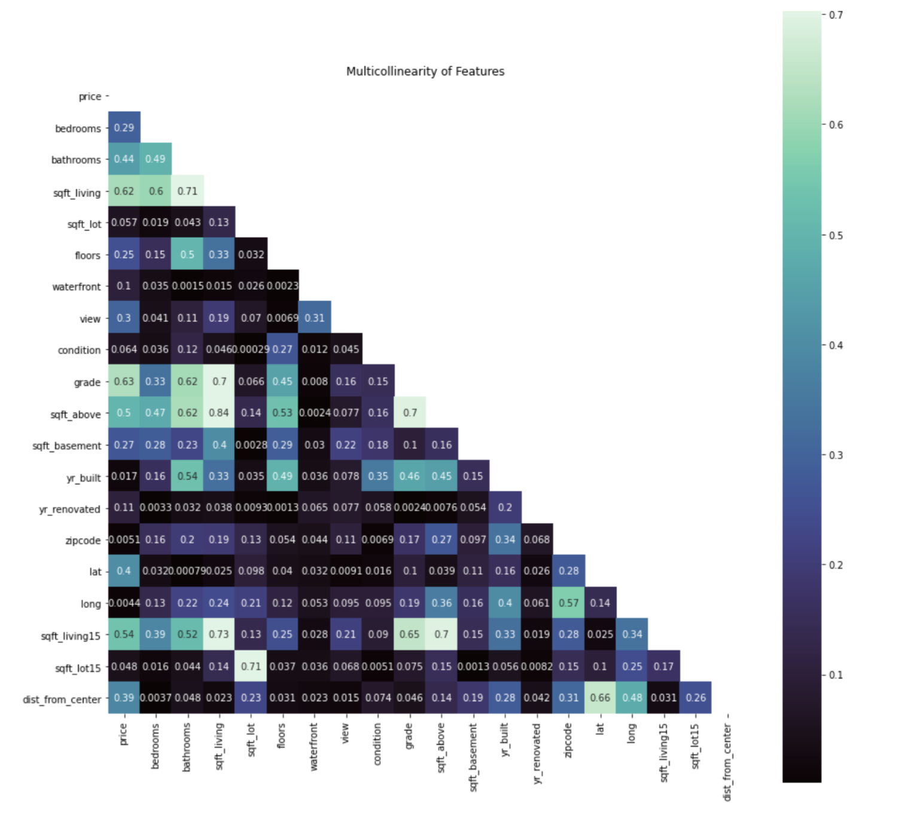
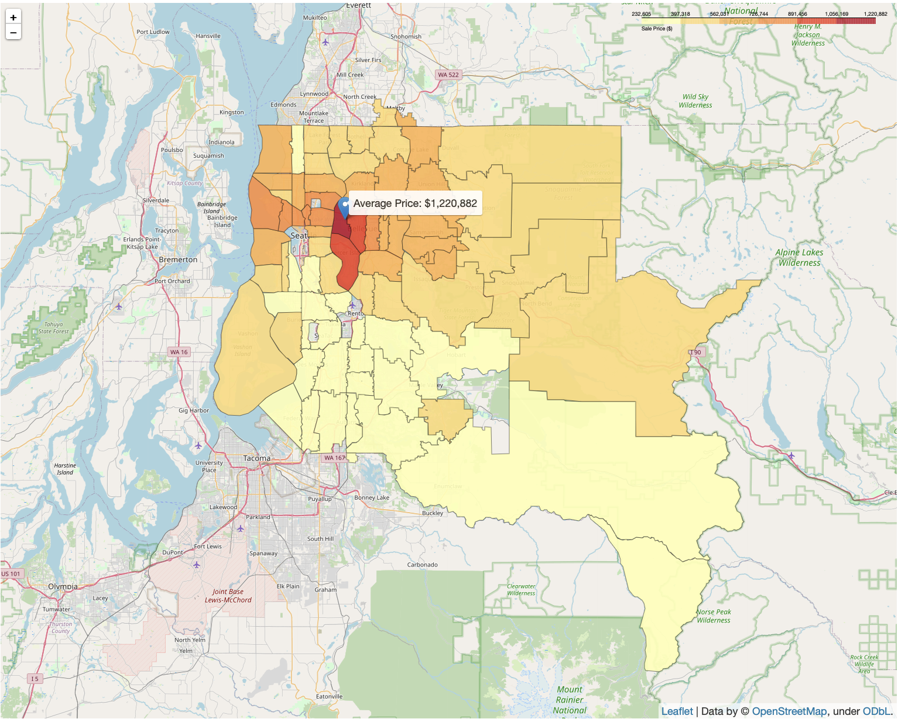

# *King County Housing: Predicting House Prices with Multiple Linear Regression*

Ian Sharff, Samantha Baltodano, and Sanjit Varma

## Table of Contents
* [Overview](#overview)
* [Business Understanding](#business-understanding)
* [Data Understanding](#data-understanding)
* [Data Preparation](#data-preparation)
* [Model Training and Testing](#model-training-and-testing)
* [Analysis and Conclusions](#analysis-and-conclusions)
* [Contributors](#contributors)
* [Project Structure](#project-structure)

## Repository Links
* [Data](/data)
* [Python scripts](/tools)
* [Images](/images)

## Overview

In this project, we outline our process of creating an effective and reasonably accurate model to predict sales prices for houses in and around Seattle, Washington. Using data from house sales in 2014 and 2015 from a total of 70 different zip codes, we were able to design and train several models with acceptable accuracies given their complexity and inherent limitations. Specifically, we saught to use multiple linear regression models via the `statsmodels` and `sklearn` libraries in Python, and we briefly explored the Gradient Boost Regressor to understand how it could be used to improve the quality of future analyses.

## Business Understanding

We framed our business problem from the perspective of Zillow, a company that relies on its ability to provide relevant and accurate "Zestimates" for houses listed to rent and to buy. These estimates are very often accurate in their depiction of a property's value; however, like most predictive models, there are always cases when it <a href=https://onesouthrealty.com/zillow-sued-over-zestimates-and-we-all-rejoiced>misses the mark</a>. From this (hypothetical) standpoint, our goal is to find attributes of a home that should be incorporated into the Zestimate model to minimize the harmful consequences of innacurate predictions on homeowners. By no means is this a comprehensive solution; rather, we hope to highlight the features available to us in the data that were the most indicative of a property's sale price. In addition, we seek to find ways in which feature engineering can play a role in fine-tuning the accuracy of our models and the ramifications it could have on improving the Zillow Zestimate.

## Data Understanding

The data provided to us consist of information pertaining to over 20,000 house sales carried out between 2014 and 2015, located in the `data/kc_house_data.csv` file in this repository along with the `data/column_names.md` data dictionary summarizing the information contained in each of the 19 relevant features, not inluding the `id` column which can be discarded for our purposes. Some salient features that were found to have high correlation with the sale price were:

* `sqft_living` -  the area in square feet of the living space of the home
* `grade` and `condition` - two indicators of the subjective quality of the home
* `lat`, `long`, and `zipcode` - which conveyed valuable locational information regarding the homes
* `bedrooms` and `bathrooms` - two important metrics for most, if not all, homebuyers.

Of course, all features have the capacity to provide valuable insight property price. However, within the constraints of a basic multiple linear regression model, including many features runs the risk of having multicollinearity among features, which can be a detriment to the quality of the predictive capacity of a model. To visualize this, we frequently used the follwing heatmap visualization to quantify the pairwise correlations between the features and the target. See the [data visualization](tools/data_visualization.py) script for its implementation.



This led us to the conclusion that, while most features were in some way correlated with a given house's price, we would have to selectively choose which features to minimize multicollinearity. Certain features like `sqft_living15` and `sqft_lot15`, which denote the average living space/lot square footage of a house's nearest 15 neighbors, caught our attention, but were (unsurprisingly) found to be highly correlated with their analogous features `sqft_living` and `sqft_lot` which describe the individual houses. These features definitely have potential, but in the context of this study they were left aside.

The `lat` and `long` features denoting the houses' geographical coordinates were, however, used to calculate the distance from the most expensive zipcode in King County, 98039. We determined this after constructing the following choropleth map using the `folium` library



This map led us to conclude that proximity to affluent neighborhoods such as this would increase a properties value. Thus, we decided to include this feature in the model with good results.

## Data Preparation

Nearly all practical datasets will contain null values that need to be addressed, and the data provided to us for this study was no different. However, only four columns had missing values to be converted.

* `view` - the number of times viewed by prospective buyers
* `waterfront` - whether the house was located next to a body of water
* `sqft_basement` - square footage of the home's basement (if it has one)
* `yr_renovated` - the year a house was renovated (if it ever had been)

In each of these cases, we found it appropriate to fill these columns with their modes, which represented the overwhelming majority of values pertaining to each feature (most houses hadn't been viewed, most were not waterfront properties, etc.). However, these features were not heavily considered either due to high correlation with the living space square footage or becuase they did not improve models to a large enough extent to warrant adding further multicollinearity to the models. More on that in the next section.

As mentioned previously, the engineered feature, `dist_from_center` was added by calculating the Euclidian distance from the average coordinates of houses in the most expensive zipcode on average (see the `add_distance` function in [data preparation](tools/data_preparation.py) script for the implementation). 

## Model Training and Testing

The first model included in our Jupyter Notebook highlighting this our process was a baseline model created with sci-kit learn's `DummyRegressor`, which simply predicted the mean price for every data point without factoring in the independent variables. While in this context it may have proven redundant, yielding an (expected) R-squared value of 0, this was done to get a feel for the importance of baseline models in machine learning in general. Following this, a simple linear regression was conducted with `price` and `sqft_living`, since they were the most heavily correlated in the original, untrimmed dataset. 

## Analysis and Conclusions

An important takeaway from this study is that a home's living space square footage and its location are two of the most important factors contributing to its price. In addition to this, we found that many metrics used to determine a house's value are largely dependent on one another. To provide an intuitive example, it would make sense that a larger home would recieve a higher grade, and this correlation could lead to overfitting of a simplistic model like multiple linear regression. As such, future iterations of this project should include more thorough use of the `GradientBoostRegressor` estimator from `sklearn.ensemble` to arrive at a more accurate model.

In addition, the use of coordinates and the presence of "nearest 15 neighbors" features in the initial dataset has led us to conclude that an implementation of the K-Nearest Neighbor algorithm to this and other similar datasets would be a fruitful endeavor. Only so much can be accomplished in a week of work, but throughout the course of this study we now understand that there are many avenues for us to take in improving the models as they exist now.

## Contributors
- Samantha Baltodano <br>
    Github: sbaltodano<br>
- Sanjit Varma <br>
    Github: sanjitva<br>
- Ian Sharff <br>
    Github: iansharff<br>

## Project Structure
```
├── P2_Project.ipynb
├── README.md
├── data
├── images
└── tools
    ├── __init__.py
    ├── data_preparation.py
    ├── data_visualization.py
    └── helpers.py
```
